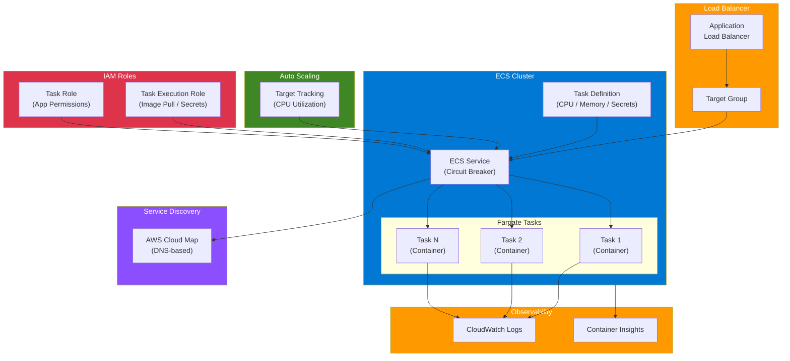

# terraform-aws-ecs-fargate

A production-ready Terraform module for deploying containerized applications on **AWS ECS Fargate** with built-in support for service discovery, autoscaling, deployment circuit breaker, blue/green deployments, and Container Insights.

## Architecture Diagram



## Features

- **ECS Cluster** with optional CloudWatch Container Insights
- **Fargate Task Definitions** with multi-container support, secrets injection, and health checks
- **ECS Service** with configurable deployment strategies
- **Deployment Circuit Breaker** with automatic rollback on failed deployments
- **Blue/Green Deployment** support via ALB target group integration
- **Application Auto Scaling** based on CPU utilization with configurable min/max capacity
- **AWS Cloud Map Service Discovery** for internal service-to-service communication
- **ECS Exec** for interactive container debugging
- **IAM Roles** for task execution (image pull, secrets) and task (application permissions)
- **CloudWatch Logs** with configurable retention
- **Security Group** with least-privilege ingress on the container port

## Usage

```hcl
module "ecs_fargate" {
  source  = "kogunlowo123/ecs-fargate/aws"
  version = "1.0.0"

  cluster_name = "my-cluster"
  service_name = "my-api"

  task_cpu    = 512
  task_memory = 1024

  container_definitions = [
    {
      name  = "api"
      image = "123456789012.dkr.ecr.us-east-1.amazonaws.com/api:latest"
      port_mappings = [
        { containerPort = 8080 }
      ]
      environment = [
        { name = "ENV", value = "production" }
      ]
      secrets = [
        { name = "DB_PASSWORD", valueFrom = "arn:aws:ssm:us-east-1:123456789012:parameter/prod/db-pass" }
      ]
    }
  ]

  vpc_id     = "vpc-0123456789abcdef0"
  subnet_ids = ["subnet-aaa", "subnet-bbb"]

  container_port      = 8080
  lb_target_group_arn = aws_lb_target_group.api.arn

  enable_autoscaling     = true
  min_capacity           = 2
  max_capacity           = 10
  target_cpu_utilization = 70

  enable_circuit_breaker    = true
  enable_container_insights = true

  tags = {
    Environment = "production"
  }
}
```

## Examples

| Example | Description |
|---------|-------------|
| [basic](./examples/basic/) | Minimal single-container deployment |
| [advanced](./examples/advanced/) | Autoscaling, circuit breaker, ECS Exec, and ALB |
| [complete](./examples/complete/) | All features including service discovery and sidecar containers |

## Requirements

| Name | Version |
|------|---------|
| terraform | >= 1.5.0 |
| aws | >= 5.0 |

## Inputs

| Name | Description | Type | Default | Required |
|------|-------------|------|---------|----------|
| `cluster_name` | Name of the ECS cluster | `string` | n/a | yes |
| `service_name` | Name of the ECS service | `string` | n/a | yes |
| `task_cpu` | CPU units for the Fargate task | `number` | `256` | no |
| `task_memory` | Memory (MiB) for the Fargate task | `number` | `512` | no |
| `container_definitions` | List of container definition objects | `any` | n/a | yes |
| `vpc_id` | VPC ID for the ECS service | `string` | n/a | yes |
| `subnet_ids` | Subnet IDs for the ECS tasks | `list(string)` | n/a | yes |
| `assign_public_ip` | Assign public IP to ENI | `bool` | `false` | no |
| `enable_service_discovery` | Enable Cloud Map service discovery | `bool` | `false` | no |
| `namespace_id` | Cloud Map namespace ID | `string` | `""` | no |
| `enable_autoscaling` | Enable Application Auto Scaling | `bool` | `false` | no |
| `min_capacity` | Minimum task count | `number` | `1` | no |
| `max_capacity` | Maximum task count | `number` | `4` | no |
| `target_cpu_utilization` | Target CPU % for autoscaling | `number` | `70` | no |
| `enable_circuit_breaker` | Enable deployment circuit breaker with rollback | `bool` | `true` | no |
| `enable_execute_command` | Enable ECS Exec | `bool` | `false` | no |
| `lb_target_group_arn` | ALB/NLB target group ARN | `string` | `""` | no |
| `container_port` | Container port for LB and SG | `number` | `80` | no |
| `health_check_path` | HTTP health check path | `string` | `"/health"` | no |
| `enable_container_insights` | Enable Container Insights | `bool` | `true` | no |
| `log_retention_days` | CloudWatch log retention in days | `number` | `30` | no |
| `tags` | Map of tags for all resources | `map(string)` | `{}` | no |

## Outputs

| Name | Description |
|------|-------------|
| `cluster_id` | ID of the ECS cluster |
| `cluster_arn` | ARN of the ECS cluster |
| `cluster_name` | Name of the ECS cluster |
| `service_id` | ID of the ECS service |
| `service_arn` | ARN of the ECS service |
| `service_name` | Name of the ECS service |
| `task_definition_arn` | Full ARN of the task definition |
| `task_definition_family` | Family of the task definition |
| `task_definition_revision` | Revision of the task definition |
| `task_execution_role_arn` | ARN of the task execution IAM role |
| `task_role_arn` | ARN of the task IAM role |
| `security_group_id` | Security group ID for the ECS service |
| `log_group_name` | CloudWatch log group name |
| `log_group_arn` | CloudWatch log group ARN |
| `service_discovery_arn` | Cloud Map service discovery ARN |
| `autoscaling_target_resource_id` | Autoscaling target resource ID |

## Architecture

```
                    +------------------+
                    |   ALB / NLB      |
                    +--------+---------+
                             |
                    +--------v---------+
                    |   Target Group   |
                    +--------+---------+
                             |
              +--------------+--------------+
              |        ECS Service          |
              |  (Circuit Breaker enabled)  |
              +--------------+--------------+
              |              |              |
         +----v----+   +----v----+   +----v----+
         |  Task 1 |   |  Task 2 |   |  Task N |
         | (Fargate)|  | (Fargate)|  | (Fargate)|
         +---------+   +---------+   +---------+
              |              |              |
         +----v--------------v--------------v----+
         |          CloudWatch Logs               |
         |        Container Insights              |
         +----------------------------------------+
```

## Blue/Green Deployment

This module supports blue/green deployments via ALB target group switching. Provision two instances of the module with different target groups and swap them at the ALB listener level.

## License

MIT License. See [LICENSE](./LICENSE) for details.

## Author

[kogunlowo123](https://github.com/kogunlowo123)
